# Guía de ejecución de proyectos

Todos los proyectos se ejecutan bajo un entorno Node.js. Los pasos para ejecutarlos son similares para cada uno.

## Pasos generales:

1. Ingresar al proyecto de interés:
    - `../reactmovil`
    - `../backend`
    - `../frontend`

2. Instalar las dependencias ejecutando el siguiente comando:
    ```bash
    npm install
    ```

3. Para ejecutar el proyecto en un servidor local, se utiliza una configuración de compilación basada en el archivo `package.json` que se encuentra en cada uno de los proyectos de manera independiente (en modo `dev` o `debug`).

---

## Proyecto 1: Backend (Node.js + Express.js)

### Configuración de la base de datos (PostgreSQL):

Configure docker, descargue la imagen de PostgreSQL

Ejecute en un terminal de comandos:
- docker pull postgres
- docker run --name postgres-container -e POSTGRES_DB=postgres -e POSTGRES_USER=postgres -e POSTGRES_PASSWORD=password -p 5432:5432 -d postgres
- Una vez iniciado el contenedor Docker, Abro un gestor de base de datos 'DBEAVER'
- Creo una conexion de la base de datos 
- Abro el script
- Ejecuta el siguiente script en PostgreSQL para crear la tabla de productos e insertar datos de ejemplo:

```sql
CREATE TABLE products (
    id INT GENERATED ALWAYS AS IDENTITY PRIMARY KEY,
    name VARCHAR(255) NOT NULL,
    description TEXT NOT NULL,
    price DECIMAL(10, 2) NOT NULL,
    status BOOLEAN,
    createdAt TIMESTAMP DEFAULT CURRENT_TIMESTAMP,
    updatedAt TIMESTAMP DEFAULT CURRENT_TIMESTAMP
);

INSERT INTO products (name, description, price, status) VALUES 
('Laptop', 'Laptop de alta gama con procesador i7', 1200.99, true ), 
('Smartphone', 'Teléfono inteligente con cámara de 12MP', 799.49, false), 
('Headphones', 'Auriculares inalámbricos con cancelación de ruido', 199.99, false), 
('Keyboard', 'Teclado mecánico retroiluminado', 89.95, false), 
('Monitor', 'Monitor 4K de 27 pulgadas', 379.89, true);
```

# Verificar variables de entorno para la conexion a la base de datos
## en el archivo que esta en la raiz .env del backend 

```
PORT=...
DB_HOST=...
DB_USER=...
DB_PASS=...
```
### Ejecutar Express.js
```
npm run dev # ó  "nodemon src/app.ts"
npm run debug # ó "nodemon --exec \"node --inspect -r ts-node/register\" src/app.ts"
```

---

## Proyecto 2: Frontend ReactJS + Vite + Tailwind
### Ejecutar React
```npm run dev # ó "vite"
npm run debug # ó "vite debug"
```
---

## Proyecto 3: Movil ReactNative (Estatico)
 
Requisito Adicional
- Tener un Emulador Android instalado y ejecutandose

### Para ejecutar con CLI de reactNative
```
npm run start # ó ("expo start")
```

### Para abrir directamente la aplicacion en el emulador
```
npm run android 
```

## CAPTURAS BACKEND

## Api lista de productos
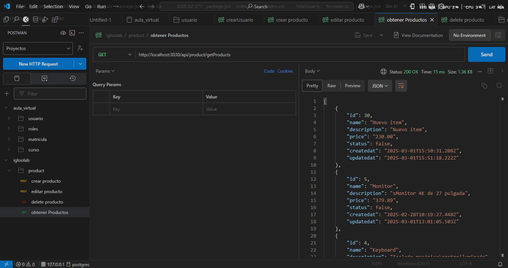

## Api crear producto
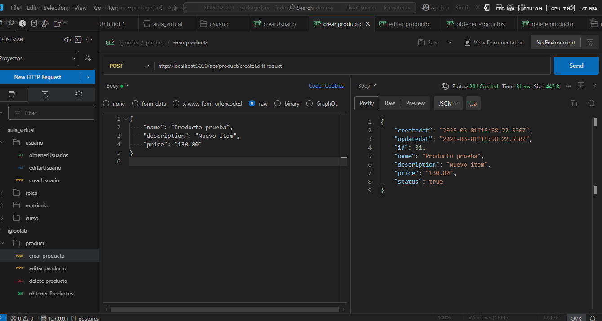

## Api editar producto
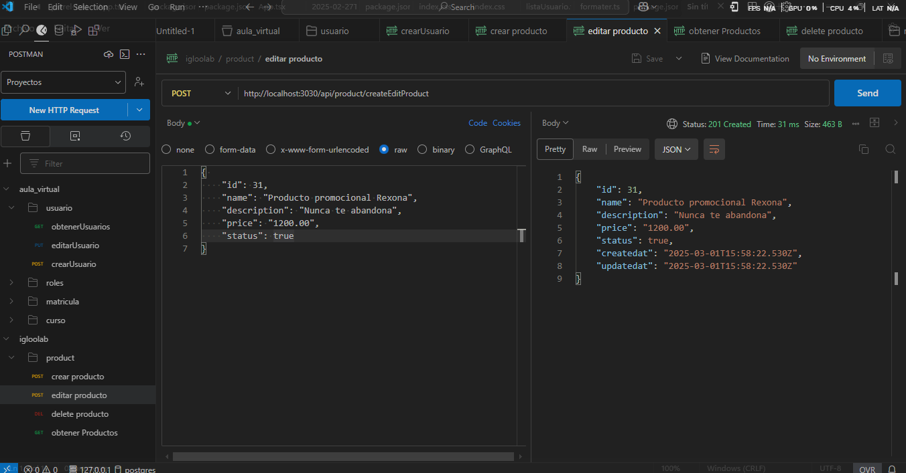


## CAPTURA FRONTEND

## Lista de items
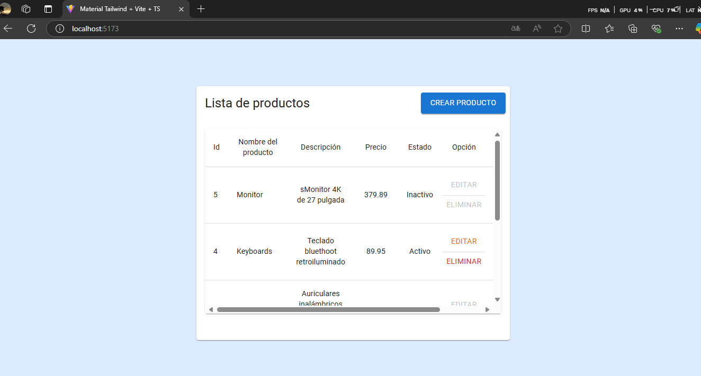

## Editar item
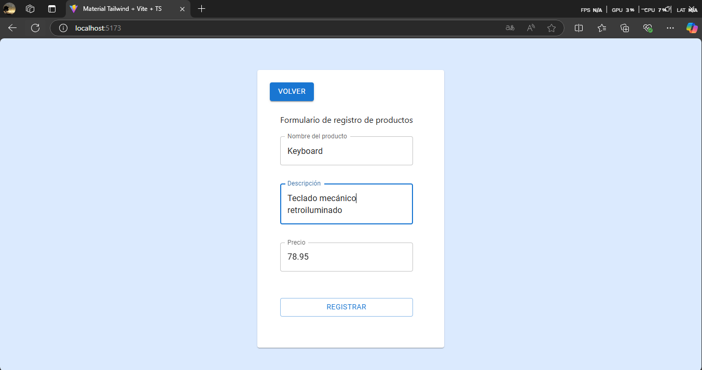

## Confirmar item editado


## Validacion de inputs
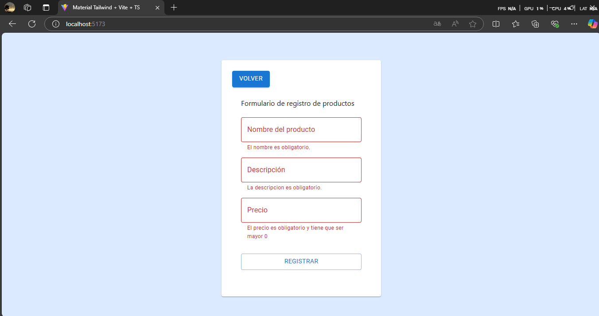

## Creación un nuevo producto
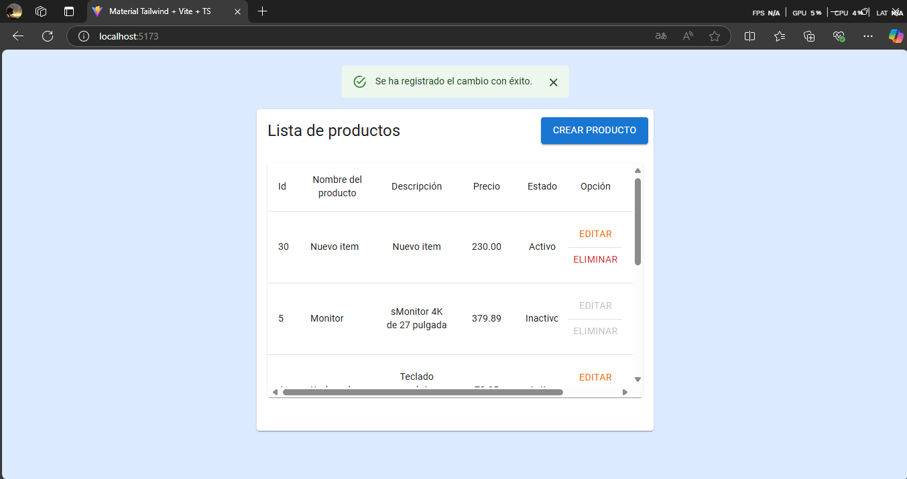

## Modal de confirmación para eliminar
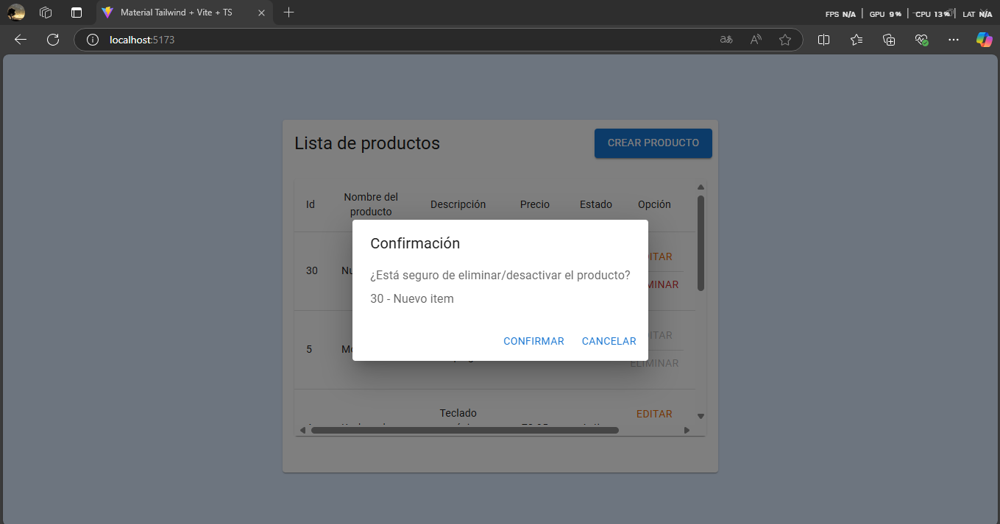

## Confirmar item eliminado - inactivo
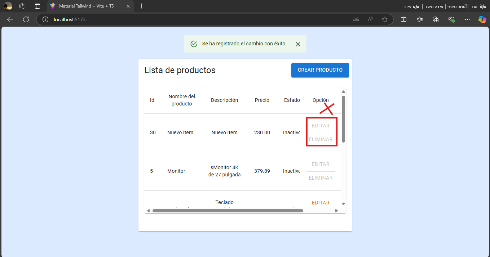


## CAPTURAS MOVIL - EMULADOR ANDROID

## Listado de items
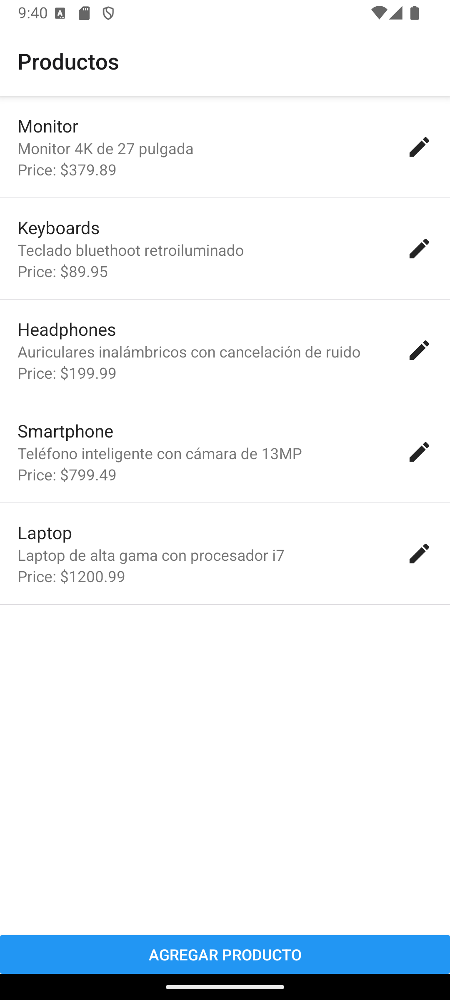

## Edición de un item
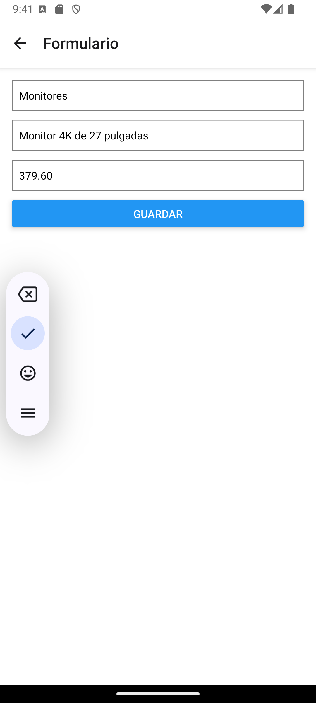

## Confirmación item editado
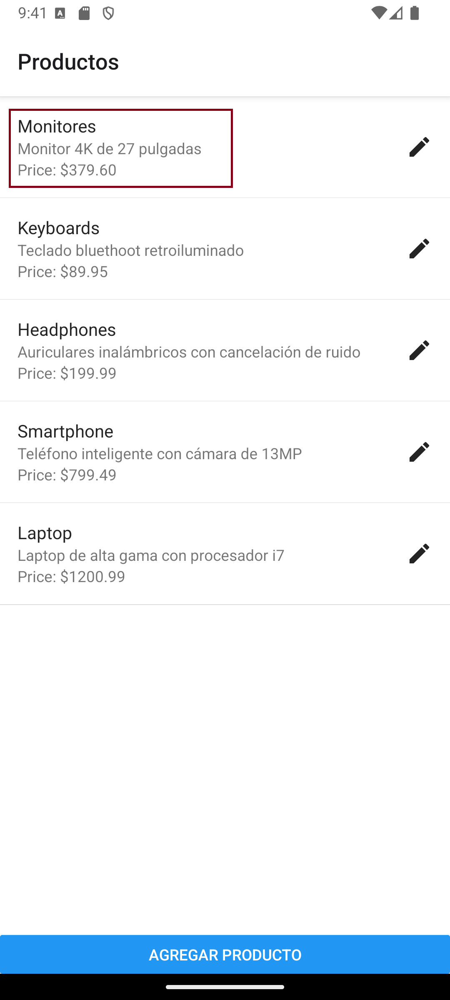

## Agregar un nuevo item
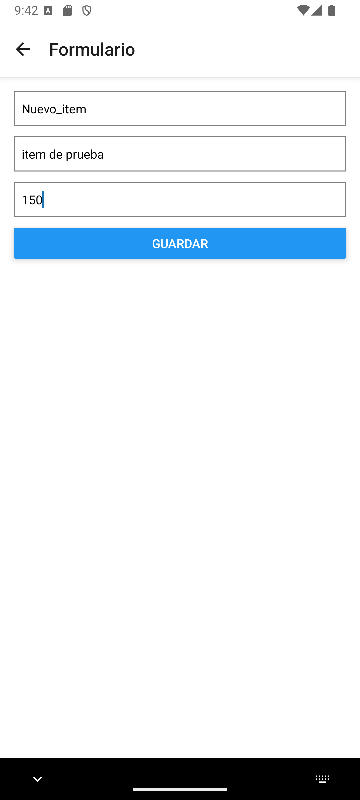

## Confirmación de item agregado


# 4. COMO IMPLEMENTAR UNA API EN .NET

En este repositorio adjunto un proyecto con una configuracion base con
el fin de ilustrar una configuracion a medida. No es compilable el proyecto.

MyApp
 ── Config
     ── ApplicationDbContext.cs
 ── Controllers
     ── ProductsController.cs
 ── Models
     ── Product.cs
 ── Services
     ── ProductService.cs
 ── appsettings.json
 ── MyApp.csproj
 ── Program.cs
 ── Startup.cs

# Paso 1: Instalar el SDK de .NET
## Descarga e instala el SDK de .NET desde el sitio oficial de Microsoft.

# Paso 2: Crear un nuevo proyecto .NET
## Abre una terminal o símbolo del sistema y navega al directorio donde deseas crear el nuevo proyecto. Luego, ejecuta el siguiente comando:
```
dotnet new webapi -n TuNuevoProyecto
```
# Paso 3: Ingresas a tu proyecto
```
cd TuNuevoProyecto
```

# Paso 4: Generas las siguientes carpetas
```
mkdir -p Controllers Models Services Config
```

# Paso 5: Agregar los paquetes necesarios
Ejecutar los siguientes scripts en cmd

```
dotnet add package Microsoft.EntityFrameworkCore
dotnet add package Microsoft.EntityFrameworkCore.SqlServer
dotnet add package Microsoft.Extensions.Configuration
dotnet add package Microsoft.Extensions.DependencyInjection
```

# Paso 6: Configurar
```
Implementar servicios, modelos, controllers y la configuracion startup.cs y de la base de datos
```

# Paso 7: Ejecutar el proyecto
```
dotnet run
```